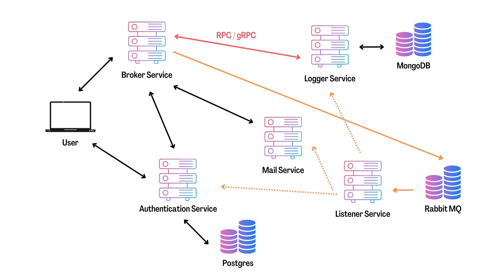

## A Simple Microservices Instance in Golang

* Reference: [Working with Microservices in Go (Golang)](https://www.udemy.com/course/working-with-microservices-in-go/)

---
#### Basic Structure:

* front-end service: display the web pages.
* broker-service: one of entry points of the system to connect to all the other services.
* auth-service: authenticates users and connect to a Postgres database.
* logger-service: logs information into a MongoDB.
* mail-service: sends email.
* listener-service: consumes messages through amqp, and sends instructions into the destination service.

### How to run the system, please follows [this](./GoMicro_project/README.md) in the *GoMicro_project*.
